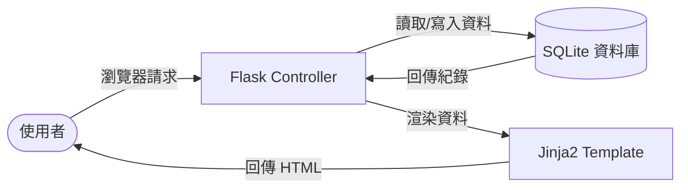

# 系統架構文件 (ARCHITECTURE.md)

本文件根據 [PRD.md](docs/PRD.md) 的需求，規劃「個人記帳本」系統的技術架構與實作方案。

## 1. 技術架構說明

本系統採用 **Monolithic (單體式) 架構**，使用 Python 的 Flask 框架結合 Jinja2 模板引擎進行開發。

### 選用技術
- **後端框架**：Flask (輕量級，適合快速開發小工具)。
- **模板引擎**：Jinja2 (與 Flask 深度整合，負責動態 HTML 渲染)。
- **資料庫**：SQLite (內嵌式資料庫，無需額外安裝伺服器，方便部署)。
- **樣式設計**：Vanilla CSS (現代 CSS 特性如 Grid / Flexbox，打造流暢 UI/UX)。

### MVC 模式說明
雖然 Flask 本身不強制要求 MVC，但本專案將遵循此結構：
- **Model (資料模型)**：負責定義資料表結構 (SQLite) 並處理資料讀寫。
- **View (視圖)**：Jinja2 HTML 模板，負責將資料視覺化呈現給使用者。
- **Controller (控制器)**：Flask 路由 (Routes)，負責處理 HTTP 請求、運算邏輯並指派資料給視圖。

---

## 2. 專案資料夾結構

```text
web_app_development/
├── app/
│   ├── __init__.py       # 應用程式初始化 (App Factory)
│   ├── models/           # 資料庫模型 (定義 Record 資料表)
│   ├── routes/           # 路由模組 (控制收支紀錄的 CRUD)
│   ├── templates/        # Jinja2 模板 (首頁、編輯頁、報表頁)
│   └── static/           # 靜態資源 (CSS 樣式、JavaScript 動效)
├── docs/
│   ├── PRD.md            # 需求文件
│   └── ARCHITECTURE.md   # 架構文件 (本文件)
├── instance/             # Flask 實體資料夾
│   └── database.db       # SQLite 資料庫檔案
├── app.py                # 應用程式啟動點
├── requirements.txt      # 專案套件依賴清單
└── README.md             # 執行與安裝說明
```

---

## 3. 元件關係與資料流

### 系統流程圖


### 資料流說明
1. **新增紀錄**：使用者在頁面輸入表單 → Flask Route 接收 POST 請求 → 邏輯驗證 → Model 寫入 SQLite。
2. **查看統計**：使用者進入頁面 → Flask Route 從 SQLite 讀取該月所有收支 → Controller 計算類別比例與餘額 → Jinja2 渲染圖表與清單。

---

## 4. 關鍵設計決策

1. **單頁儀表板設計**：為了流暢的體驗，主要的「餘額統計」、「快速新增」與「歷史清單」會整合在一個高效能的首頁 (Dashboard)，減少頁面跳轉。
2. **SQLite 原生整合**：不使用複雜的 ORM（如 SQLAlchemy），直接使用 Python 的 `sqlite3` 模組或簡單封裝，適合初學者理解底層資料操作。
3. **CSS 現代化**：使用 CSS Variables 定義配色方案，確保深色模式 (Dark Mode) 或主題延伸的便利性。
4. **前端零依賴**：不使用大型 JS 框架 (如 React/Vue)，而是用 Vanilla JS 處理圖表顯示 (如 Chart.js 的 CDN 引入或簡約的 SVG 繪製)，保持專案輕量。

---
