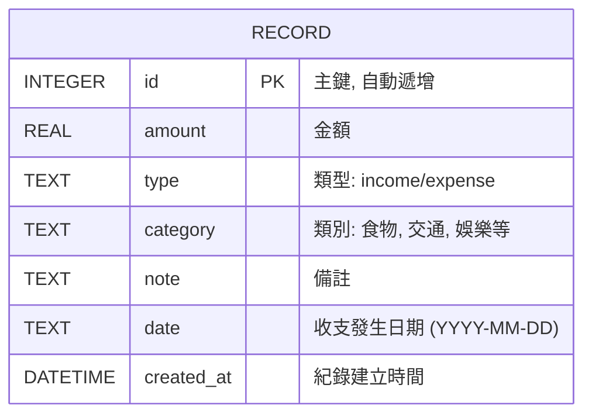

# 資料庫設計文件 (DB_DESIGN.md)

本文件定義「個人記帳本」系統的資料庫結構與操作邏輯。

## 1. ER 圖 (Entity-Relationship Diagram)

系統初期採單表設計，專注於收支紀錄管理。



---

## 2. 資料表詳細說明

### Table: `records`
儲存所有的收入與支出明細。

| 欄位名稱 | 型別 | 說明 | 必填 | 預設值 |
| :--- | :--- | :--- | :--- | :--- |
| `id` | INTEGER | 主鍵 (Primary Key) | 是 | AUTOINCREMENT |
| `amount` | REAL | 收支金額（支出為正值，邏輯由 type 區分） | 是 | - |
| `type` | TEXT | 類別標籤：`income` (收入) 或 `expense` (支出) | 是 | - |
| `category` | TEXT | 消費種類，如：食物、交通、購物、薪水 | 是 | '其他' |
| `note` | TEXT | 額外的補充說明 | 否 | NULL |
| `date` | TEXT | 事件日期，格式為 YYYY-MM-DD | 是 | (當前日期) |
| `created_at` | DATETIME | 系統建立該筆資料的時間 | 是 | CURRENT_TIMESTAMP |

---

## 3. SQL 建表語法

語法儲存於 [database/schema.sql](database/schema.sql)。

```sql
CREATE TABLE IF NOT EXISTS records (
    id INTEGER PRIMARY KEY AUTOINCREMENT,
    amount REAL NOT NULL,
    type TEXT NOT NULL CHECK(type IN ('income', 'expense')),
    category TEXT NOT NULL DEFAULT '其他',
    note TEXT,
    date TEXT NOT NULL,
    created_at DATETIME DEFAULT CURRENT_TIMESTAMP
);
```

---

## 4. Python Model 說明

資料模型實作於 `app/models/record.py`。
- 使用 Python 內建的 `sqlite3` 模組。
- 實作 `Record` 類別，封裝所有 CRUD 方法。
- 提供 `get_balance()` 靜態方法計算總餘額。

---
