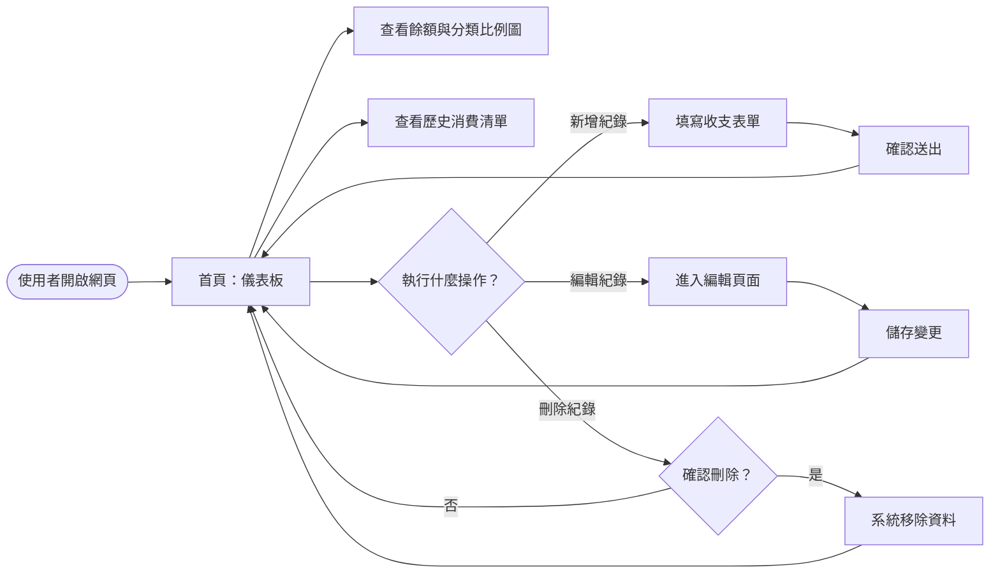
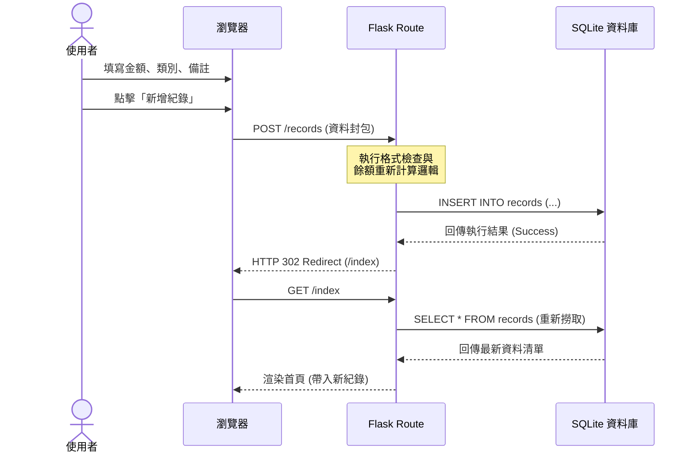

# 系統流程圖 (FLOWCHART.md)

本文件使用 Mermaid 語法視覺化「個人記帳本」的使用者操作路徑與系統內部的資料流。

## 1. 使用者流程圖 (User Flow)

描述使用者進入網頁後的主要操作路徑。

---

## 2. 系統序列圖 (Sequence Diagram)

以「新增一筆支出」為例，展示前端、後端與資料庫之間的互動。

---

## 3. 功能清單對照表

下表列出系統主要功能對應的路由與請求方法。

| 功能名稱 | URL 路徑 | HTTP 方法 | 說明 |
| :--- | :--- | :--- | :--- |
| **首頁儀表板** | `/` | `GET` | 顯示總餘額、統計圖表與近期紀錄 |
| **新增紀錄** | `/record/add` | `POST` | 提交新的收入或支出紀錄 |
| **編輯紀錄頁** | `/record/edit/<id>` | `GET` | 進入特定紀錄的編輯表單 |
| **更新紀錄** | `/record/edit/<id>` | `POST` | 儲存修改後的紀錄內容 |
| **刪除紀錄** | `/record/delete/<id>`| `POST` | 從資料庫中移除特定紀錄 |
| **歷史清單頁** | `/history` | `GET` | (可選) 顯示完整的歷史帳目分頁 |

---
