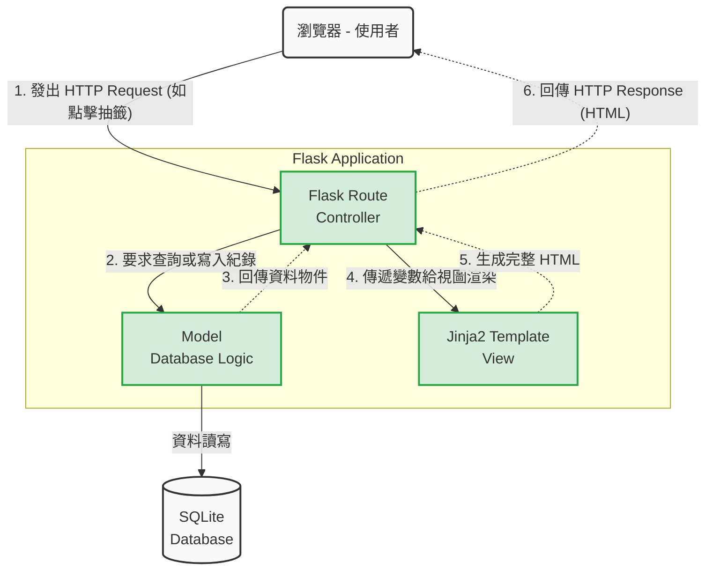

# 系統架構設計：線上算命系統

## 1. 技術架構說明

本專案採用伺服器端渲染（Server-Side Rendering, SSR）架構，不進行前後端分離，以保持架構單純，適合快速開發與驗證 MVP（最小可行性產品）。

- **選用技術與原因**：
  - **後端：Python + Flask**。Flask 是一個輕量級的網頁框架，學習曲線平緩，非常適合用來快速建立只有少數路由與功能的小型系統。
  - **模板引擎：Jinja2**。內建於 Flask 中，可以直接在 HTML 中寫入 Python 變數與邏輯（如迴圈、條件判斷），快速實現動態網頁渲染。
  - **資料庫：SQLite**。這是一個輕量級的關聯式資料庫，不需要額外架設伺服器，資料儲存在單一檔案中，非常適合初期的使用者紀錄與香油錢捐獻紀錄。

- **Flask MVC 模式說明**：
  - **Model（模型）**：負責與資料庫（SQLite）溝通。例如定義 `User`（使用者）與 `History`（算命紀錄）等資料表結構，並處理資料的新增、查詢。
  - **View（視圖）**：負責畫面呈現，由 Jinja2 搭配 HTML/CSS/JS 構成。用來呈現抽籤結果、捐獻表單與歷史紀錄畫面。
  - **Controller（控制器）**：由 Flask 的路由 (`routes`) 擔任。負責接收來自使用者的 Request（如點擊抽籤、註冊會員、送出捐獻表單），調用 Model 去要資料，最後把資料傳給 View 來產生畫面回傳給使用者。

## 2. 專案資料夾結構

以下是專案預計的資料夾結構，每個目錄與檔案皆有明確的職責劃分：

```text
web_app_development/
├── app/
│   ├── models/             ← 資料庫模型 (Models)
│   │   ├── __init__.py
│   │   ├── user.py         ← 會員資料表定義 (處理註冊登入)
│   │   └── record.py       ← 算命紀錄與捐獻紀錄資料表定義
│   ├── routes/             ← Flask 路由 (Controllers)
│   │   ├── __init__.py
│   │   ├── main.py         ← 首頁與算命/抽籤的核心路由
│   │   ├── auth.py         ← 註冊、登入與登出路由
│   │   └── api.py          ← (可選) 處理前端 AJAX 請求，像是香油錢捐獻 API
│   ├── templates/          ← Jinja2 HTML 模板 (Views)
│   │   ├── base.html       ← 共用模板（包含標頭、導覽列、頁尾）
│   │   ├── index.html      ← 首頁/算命介面
│   │   ├── result.html     ← 抽籤/算命結果顯示頁面
│   │   ├── history.html    ← 會員中心與歷史紀錄頁面
│   │   ├── donate.html     ← 香油錢捐獻頁面
│   │   └── auth/           ← 身份驗證相關視圖
│   │       ├── login.html
│   │       └── register.html
│   └── static/             ← CSS / JS 等靜態資源
│       ├── css/
│       │   └── style.css   ← 全站共用樣式 (如需客製化或擴充 Tailwind)
│       ├── js/
│       │   └── custom.js   ← 處理抽籤動畫等前端互動腳本
│       └── images/         ← 籤筒、擲筊、籤詩圖片等
├── instance/
│   └── database.db         ← SQLite 資料庫 (存放實際資料，不進版本控制)
├── docs/                   ← 專案設計文件 (PRD, 架構文件等)
├── .gitignore              ← Git 忽略檔案設定
├── app.py                  ← 專案入口檔 (初始化 Flask App)
└── requirements.txt        ← Python 套件依賴清單
```

## 3. 元件關係圖

以下展示使用者從瀏覽器發出請求，到系統處理並回傳畫面的完整流程（MVC 資料流）：



## 4. 關鍵設計決策

1. **不分離前後端，採用 Jinja2 直接渲染頁面**
   - **原因**：考量到這是一個以內容呈現與表單遞交為主的 MVP 專案，採用伺服器端渲染能省去前端框架設置以及 API 串接等跨域 (CORS) 複雜度，開發速度更快，也可以更容易處理 SEO（若未來有需要）。
2. **利用 Flask Blueprints 按功能拆分路由**
   - **原因**：為了避免所有的功能（算命、登入、捐款）都混雜在同一個 `app.py` 中，我們在 `routes/` 資料夾下利用 Blueprint 切分不同的負責範圍（例如 `main.py`, `auth.py`）。這樣可以保持程式碼整潔，方便未來擴充或除錯。
3. **資料庫單純化，採用 SQLite**
   - **原因**：系統初期主要需要記錄「會員帳號」與「過去抽籤結果」，資料量與併發數不大。選用 SQLite 不需要額外架設資料庫伺服器，且在 Python 內建支援極佳，備份也非常容易（只要拷貝一個 .db 檔案）。
4. **抽籤/擲筊等動畫效果交由前端 JavaScript 實作**
   - **原因**：互動動畫（例如搖晃籤筒、丟擲筊杯）是不需要頻繁往返後端邏輯的視覺效果。為確保畫面流暢自然，這些互動將在前端使用純 JavaScript 及 CSS 動畫負責，直到結果出爐才與後端通訊（例如儲存紀錄或判斷邏輯），減少伺服器負載。
