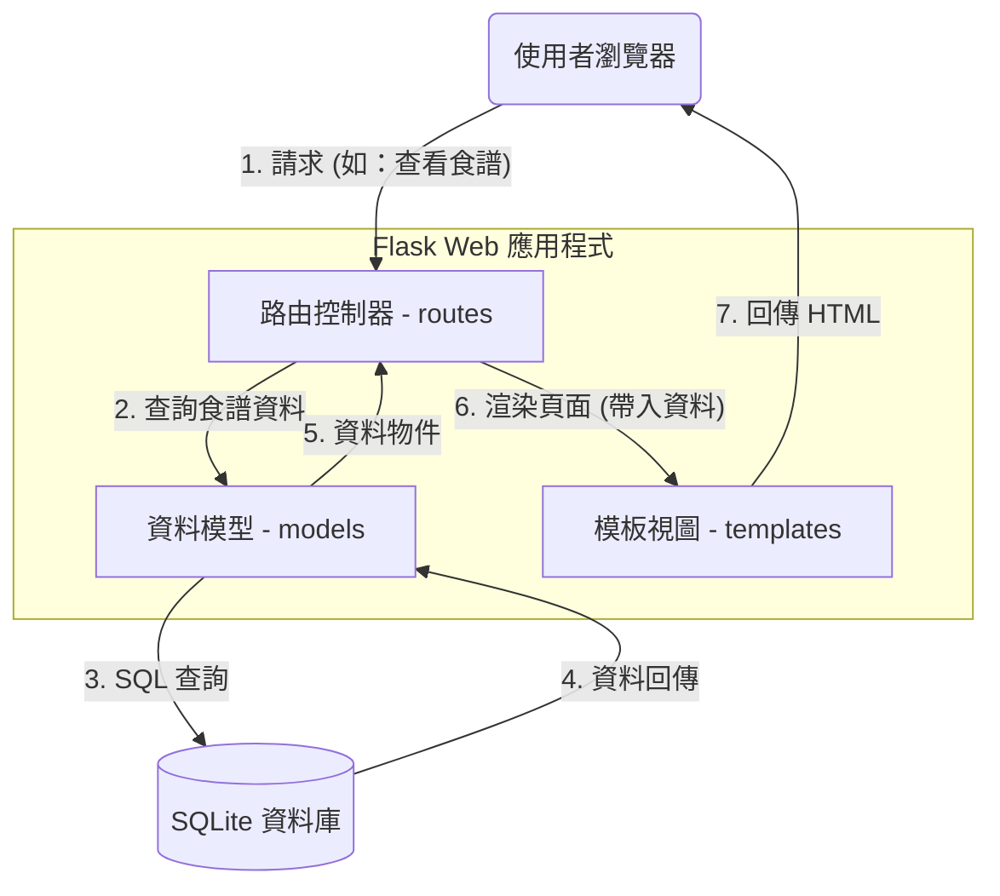

# 系統架構設計：個人食譜收藏夾 (Personal Recipe Collection)

## 1. 技術架構說明

本專案採用伺服器端渲染（Server-Side Rendering, SSR）架構，利用 Flask 框架整合 Jinja2 模板引擎與 SQLite 資料庫，確保開發效率與系統穩定性。

- **選用技術與原因**：
  - **後端：Python + Flask**。Flask 輕量且靈活，適合用於構建功能聚焦的 Web 應用程式，能快速實現路由處理與邏輯運算。
  - **模板引擎：Jinja2**。透過與 Flask 的深度整合，能直接在 HTML 中動態嵌入資料（如食譜名稱、食材列表），並支持模板繼承（Layout Inheritance）以保持頁面一致性。
  - **資料庫：SQLite**。作為輕量級的磁碟資料庫，不需要安裝額外的伺服器。食譜資料將以單一檔案格式儲存，方便攜帶與管理。

- **Flask MVC 模式說明**：
  - **Model（模型）**：定義 `Recipe` 與 `Category` 的資料結構。負責處理與 `database.db` 的連線，執行 CRUD（增刪改查）與篩選邏輯。
  - **View（視圖）**：使用 Jinja2 模板根據食譜資料生成 HTML 畫面，並透過靜態 CSS 打造溫馨且易讀的料理筆記風格。
  - **Controller（控制器）**：由 Flask 的路由 (`routes/`) 負責，解析 URL 並根據使用者動作（如點擊分類、搜尋食譜）調用 Model 取得資料，最後交由 View 呈現。

## 2. 專案資料夾結構

```text
web_app_development/
├── app/
│   ├── models/             ← 資料庫模型 (Model)
│   │   ├── __init__.py
│   │   └── recipe.py       ← 定義食譜 (Recipe) 資料表與操作邏輯
│   ├── routes/             ← Flask 路由 (Controller)
│   │   ├── __init__.py
│   │   ├── main.py         ← 首頁、清單瀏覽與篩選路由
│   │   └── recipe.py       ← 處理食譜新增、編輯、刪除的路由
│   ├── templates/          ← Jinja2 HTML 模板 (View)
│   │   ├── base.html       ← 全站通用佈局
│   │   ├── index.html      ← 全部食譜清單與分類篩選頁面
│   │   ├── detail.html     ← 單一食譜詳細內容頁面
│   │   └── recipe_form.html ← 共用的食譜新增與編輯表單
│   └── static/             ← 靜態資源
│       ├── css/
│       │   └── style.css   ← 以溫潤色調與手寫感字體為主的視覺設計
│       └── js/
│           └── main.js     ← 處理簡易的前端互動（如確認刪除彈窗）
├── instance/
│   └── database.db         ← 實際存放食譜資料的 SQLite 檔案
├── docs/                   ← 專案設計文件
├── .gitignore              ← 忽略資料庫及暫存檔案
├── app.py                  ← 應用程式入口檔與 Flask 初始化
└── requirements.txt        ← Python 套件清單 (Flask 等)
```

## 3. 元件關係圖



## 4. 關鍵設計決策

1. **模組化路由設計 (Blueprints)**
   - **理由**：將核心瀏覽與後台管理（新增、修改）路由分離至 `main.py` 與 `recipe.py`。即便未來增加更多功能（例如：匯出 PDF、分享功能），也能保持程式碼整潔，方便分工。
2. **單一資料表優先架構**
   - **理由**：初步採用扁平化結構存放食譜，將分類（Category）作為欄位。這樣在 SQLite 上的查詢效率最高，且能滿足目前功能需求，待未來有複雜分類需求時再行關聯拆分。
3. **溫馨質感的主視覺設計**
   - **理由**：食譜收藏夾是一個帶有個人溫度與生活感的工具。視覺上將採用米白色背景配上深咖啡色文字，並使用圓角邊框與卡片式佈局，營造像是實體食譜活頁簿的體驗。
4. **CRUD 一致性介面**
   - **理由**：新增與編輯將共用同一個 `recipe_form.html` 模板，這不僅能減少維護負擔，也能確保使用者在操作過程中的感受是連貫且直覺的。
