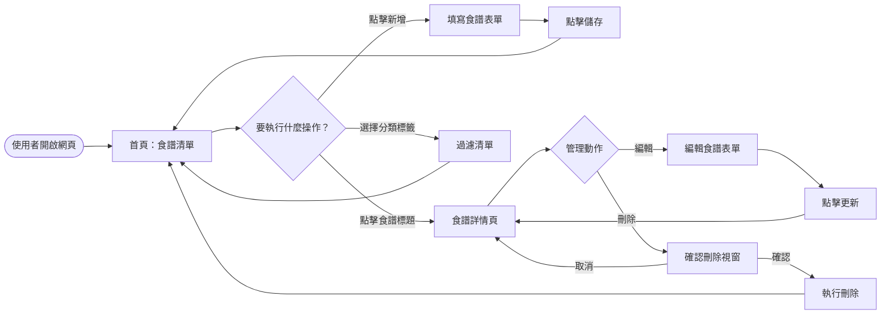
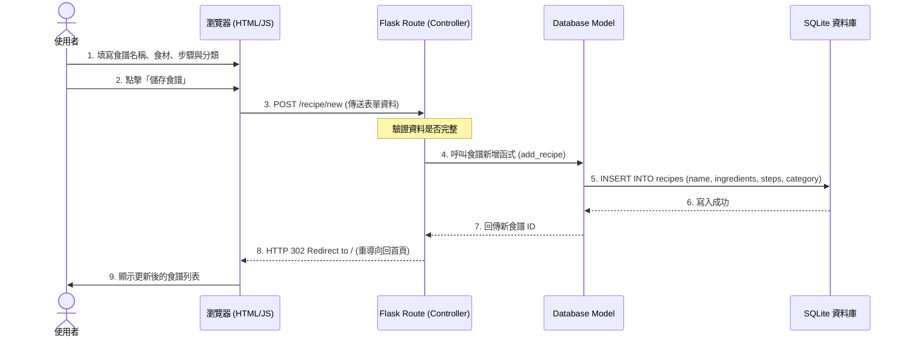

# 系統流程圖：個人食譜收藏夾 (Personal Recipe Collection)

本文件描述使用者在「個人食譜收藏夾」中的操作路徑，以及資料在前端與後端系統間的流轉流程。

## 1. 使用者流程圖 (User Flow)

此圖展示使用者從進入網站到管理食譜的完整生命週期。主要包含：瀏覽列表、新增食譜、查看詳情、編輯與刪除等核心動作。

## 2. 系統序列圖 (Sequence Diagram)

此序列圖描述以「**新增一個新食譜**」為例的系統運作細節，涵蓋從前端輸入到後端資料庫存取的過程。

## 3. 功能清單與路由對照表

以下為本專案的核心路由規劃，將作為後續開發路由 (`/api-design`) 的依據。

| 功能名稱 | URL 路徑 | HTTP 方法 | 金字塔模板 (Jinja2) | 說明 |
|----------|----------|-----------|--------------------|------|
| **食譜首頁** | `/` | GET | `index.html` | 顯示所有食譜，支援分類顯示 |
| **新增食譜頁** | `/recipe/new` | GET | `recipe_form.html` | 顯示空白表單供填寫 |
| **執行新增** | `/recipe/new` | POST | 無 (導向 `/`) | 接收資料並存入資料庫 |
| **食譜詳情頁** | `/recipe/<id>` | GET | `detail.html` | 顯示單一食譜的詳細做法 |
| **編輯食譜頁** | `/recipe/<id>/edit` | GET | `recipe_form.html` | 顯示帶有舊資料的表單 |
| **執行更新** | `/recipe/<id>/edit` | POST | 無 (導向 `/recipe/<id>`) | 更新資料庫紀錄 |
| **執行刪除** | `/recipe/<id>/delete`| POST | 無 (導向 `/`) | 刪除資料庫紀錄 |
| **分類篩選** | `/search` | GET | `index.html` | 根據 URL 參數 `category` 進行篩選 |
